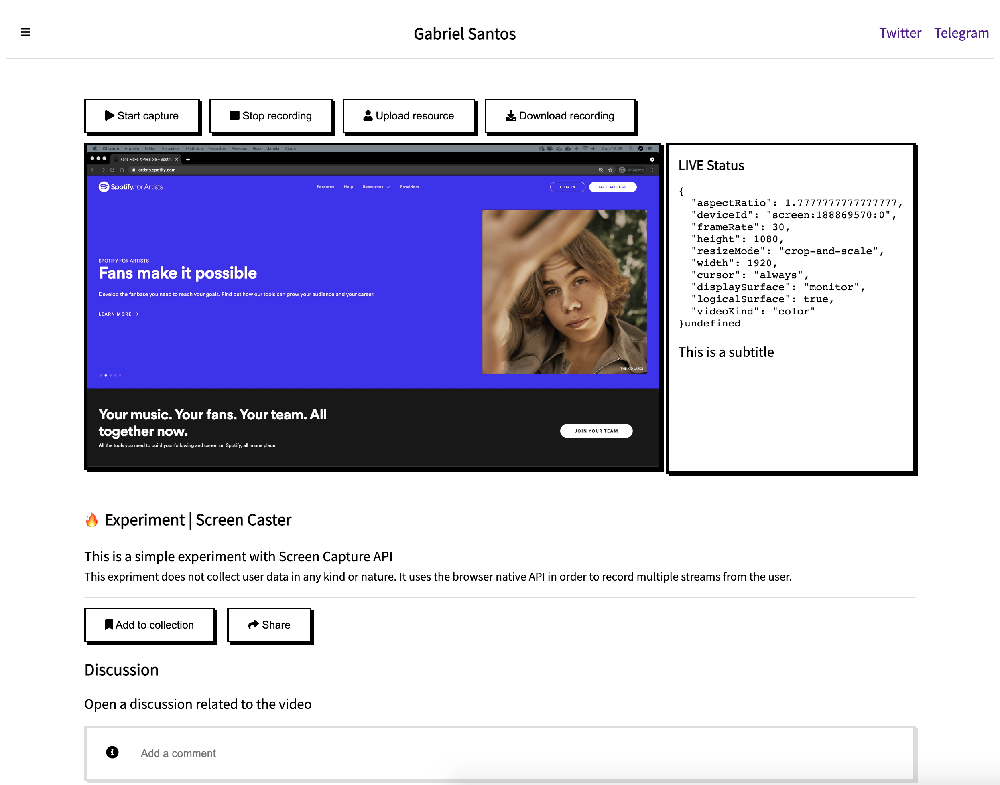

# screen-recorder
A simple screen recorder project.

  

## About 

This projects implements a simple screen recorder + audio recorder using the browser native solutions with JavaScript. It allows the user to record his mic and share the screen at the same time, to the same file.
## How to setup 

To build the SCSS files you can use VS Code extension Live Sass. It would watch the .scss files and then build them to the dist/css folder. 

Sass makes ease to generate and coordinate many elements in CSS by extending its concepts and functionalities. 
## How to execute?

You can clone the repository in your local machine and then open the Index.html file in the browser or if you are using VS Code add the extension Live Server and then with the HTML file open in the editor click on Live Server or use "Command + shift + P" to open the general search and launch "Live Server". 

## How to contribute? 

You can contribute to the project by:

- Open issues related to features and bugs found in usage 
- Making fork on the project and submitting a Pull Request 

## Next steps 
The next steps in the implementation is to:

-[ ] Add a webcam capture over the video 
-[ ] Manipulate elements position over the recorded video 
-[ ] Manipulate multiple sources at the same time 
-[ ] Manipulate multiple audio elements or textual elements at the same time 
-[ ] Provide a infrastructure to upload the recorded file via HTTP 
-[ ] Provide a solution to stream the capture to a service like Vimeo or Youtube
## License 

This repository is under MIT License. Lucas Gabriel G. dos Santos. 
